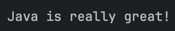
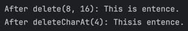
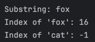
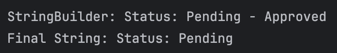

# Hands-on Lab: Exploring Java StringBuilder
## Author: Luis Maverick Gabriel

### Exercise 1: append() - Appending Content
Predicted:
Hello, Cadets!

### Exercise 2: insert() - Inserting Content at a Position
Predicted:
Java is really great!

### Exercise 3: delete() - Deleting Content
Predicted:
After delete(8, 16): This is entence.
After deleteCharAt(4): Thisis entence.

### Exercise 4: replace() - Replacing a Section
Predicted:
I like programming in PyJava

### Exercise 5: Method Chaining
Predicted:
Ready, Set, rt...

### Exercise 6: substring(), indexOf(), and Non-Existing Words
Substring: fox
Index of 'fox': 16
Index of 'cat': -1

### Exercise 7: toString() - Converting back to a String
Predicted:
StringBuilder: Status: Pending - Approved
Final String: Status: Pending

